# TER EEA 

## Création du Projet Unity pour hololens 2

### Logiciels et version

- Unity 2022.2.5f1
- MRTK 2.8.3
- Microsoft visual studio 2022

### Installation

Suivi du tuto pas à pas de Lance Larsen : http://www.lancelarsen.com/xr-step-by-step-2023-hololens-2-installing-the-tools-you-need-unity-2022-mrtk-2-8-3-visual-studio-2022/

Dans ce tuto on trouve la procédure d'installaton de unity, de visual studio et de MRTK puis la création du premier projet et le deploiement sur les hololens 2. 

Pour l'installation de visual sutio j'ai ajouté le le module "developpement .NET Desktop" recommandé par le tuto microsoft : https://learn.microsoft.com/fr-fr/windows/mixed-reality/develop/unity/unity-development-overview?tabs=arr%2CD365%2Chl2

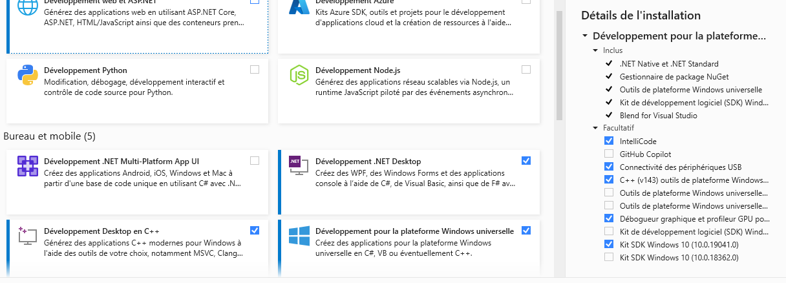

Pour l'importation de MRTK fondation, trois assets comprennent des erreurs. Comme ils ne concernent pas le hololens 2, j'ai ignoré ces erreurs.

Lors du premier premier deploiement sur visual studio il faut faire attention aux éléments suivants :

- Il faut avoir rentrer l'adresse IP des hololens dans visual studio (Projet -> Propriétés -> Débogage)
  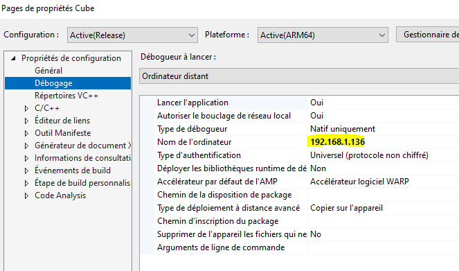
- Il faut que le PC soit en mode developpeur (Paramètres -> Mise à jour et sécurité -> Espace developpeurs -> activer le mode développeur)
- Visual Studio demande alors de rentrer un code PIN pour coupler l'ordinateur et les hololens. Ce code PIN ce trouve dans les paramètres des hololens (Paramètre  -> Mise à jour et sécurité -> Pour les developpeurs -> Coupler)

## Communication TCP IP

L'objectif est de pouvoir récupérer des données du UR10 sur une application developpée avec unity sur les hololens 2.

Dans ce projet on ne traitera pas de la configuration du serveur(l'UR10). Ce dernier, lorsqu'un client se connecte, envoie à une fréquence de 125 Hz des trames de 812 octets. 

Les bibliothèques utilisées sont 

- socket en python : https://docs.python.org/fr/3/howto/sockets.html
- System.Net.Sockets en C# : https://learn.microsoft.com/fr-fr/dotnet/api/system.net.sockets?view=net-8.0 

### Prise en main sur python

Création d'un fichier pythons client.py permettant l'établissement d'un communication TCP IP avec UR10 pour le placer à la position horizontal. Pour cela je me suis inspiré du tutoriel pour l'utilisation des sockets en python : https://www.digitalocean.com/community/tutorials/python-socket-programming-server-client

La consigne envoyée est la suivante : 

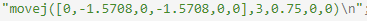

Les 6 premières valeurs coorespondent aux consignes de positions des articulations, vient ensuite l'accéleration, la vitesse ???, le radial (pour avoir des trajectoires plus souples).
**VOIR AVEC DOCUMENTATION**
Le robot se place bien à la position demandée. 

### Conversion du code en C#

Unity fonctionnant avec des scripts en C#, j'ai adapté créé un fichier clientC.cs en C# pour faire la même opération que le fichier client.py en python. Pour l'utilisation des socket en C#, je me suis inspirée de l'exemple : https://www.c-sharpcorner.com/article/socket-programming-in-C-Sharp/

### Récupération des données

Le code de clientC.cs permet d'envoyer une consigne à l'UR10. L'objectif est de pouvoir lire les données que l'UR10 envoie en continu (à une fréquence de 125 Hz). Les données bruts sont reçues sous la forme d'une trame de 812 octets. Les 4 premiers octets de cette trame sont inutiles et chaque donnée est codée sur 8 octets (format double float). L'UR10 envoie donc 101 données : 

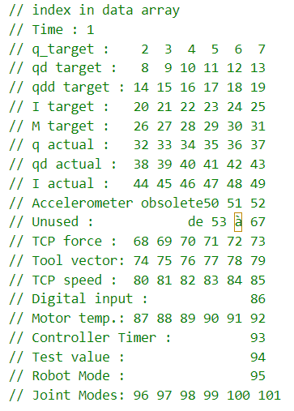

**Vérification de la conversion**

Prenons la donnée 3, en consigne on envoie $-\frac{\pi}{2} = -1.5708$. 
Si on affiche les octets recues en hexadécimal, les octets correspondant à la donnée 3 sont donc les octets de 16 à 23 :

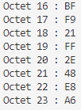

En convertissant en double, on obtient : 

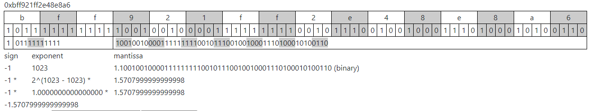

C'est bien la valeur attendu mais on remarque tout de même que la valeur de consigne de position du robot n'est pas exactement celle envoyée. De même, quand on envoie la valeur de position 0, les valeurs de consignes sont des valeurs faibles mais pas 0.

Exemple pour la donnée 2 on envoie 0 et on recoie : 

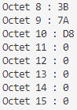

Ce qui donne : 

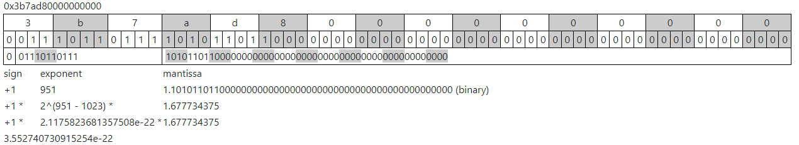

Cela peut être dû au codage des données qui peut introduire des erreurs d'arrondis mais aussi au traitement interne des données par l'UR10. 

En convertissant donc les octets reçus en "double", on obtient la liste des données :

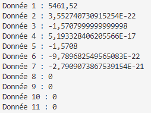

...

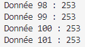 

## Passage sur unity

### Premier Projet : Affichage de l'une des données de position en temps réel

On adapte le scrip C# du client pour unity. Les script Unity possède à l'origine deux fonctions à compléter. 

- Une fonction start() qui est lancée une seule fois au lancement de l'application
- Une fontion update() qui est lancé à chaque frame (à une fréquence d'environ 120Hz mais variable, dépendant des opérations à effectuer).

Dans la fonction start(), j'initialise une connexion et envoie une commande pour que le robot se mette à la vertical. 

Dans la fonction update(), je récupère les données envoyées par le robot et les affiche dans une fenètre déplaçable. 

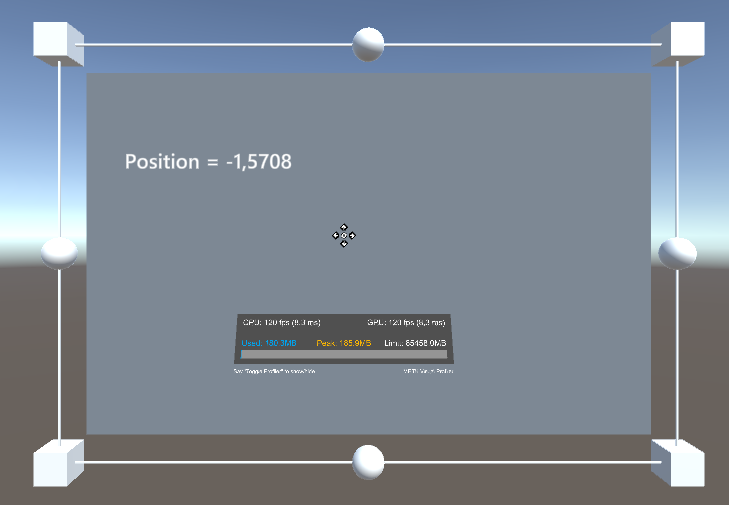

### Affichage de Graphiques

On souhaite pouvoir afficher les graphiques en temps réel des données de position (consigne et réel) et de courant (ou couple). 

Pour cela j'ai utilisé la bibliothèque Xcharts : https://xcharts-team.github.io/

Cette bibliotheque permet de créer simplemnt un graphique avec interpolation linéraire entre les points. Cependant, elle ne permet pas d'avoir un temps défilant comme on peut avoir sur un oscilloscope. Les points sont ajoutés "indéfiniment" (jusqu'a la saturation mémoire) au graphique. 

Les points possèdent les propriétés suivantes : 

- Une série
- Un index : numéro du point dans la série 
- Une valeur

La méthode chart.addData(num_serie, valeur) permet d'ajouter un point à la série sélectionnée. Le premier point aura l'index 0, le deuxième l'index 1 ect ...

La méthode chart.UpdateData(num_serie, index, valeur) permet de modifier la valeur d'un point de la série "num_série".

Ainsi en mettant en place un Buffer FIFO (First in Firt out) j'ai pu tracer de manière continue sur une fenêtre les données en procédant parselon les étapes suivantes :

- Phase 1 : Ajout au graphique (avec la méthode "chart.addData(num_serie, valeur)" ) et enregistrement dans BufferFIFO de 100 points avec les données reçues de position (à la même fréquence que celle de réception des données ou inférieure)
- Phase 2 : Décalage vers la gauche de toutes les données de bufferFIFO  sauf la dernière, mise à jour des points avec la méthode chart.UpdateData(num_serie, index, valeur).
- Phase 3 : Récupération de la donnée de position dans la dernière case de bufferFIFO, mise à jour du dernier point.
- On répète les phases 2 et 3.

Pour l'affichage du temps sur l'axe des abscisses, j'ai utilisé la méthode Time.deltaTime de unity qui renvoie le temps depuis la dernière frame (donc depuis le dernier passage dans la fonction update()).

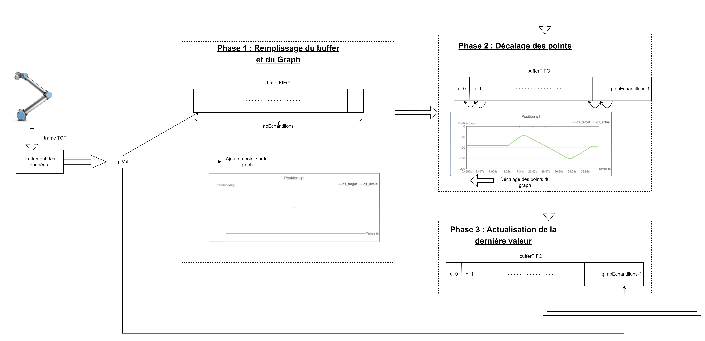

Tous ces éléments m'ont permis de créer une première application : 

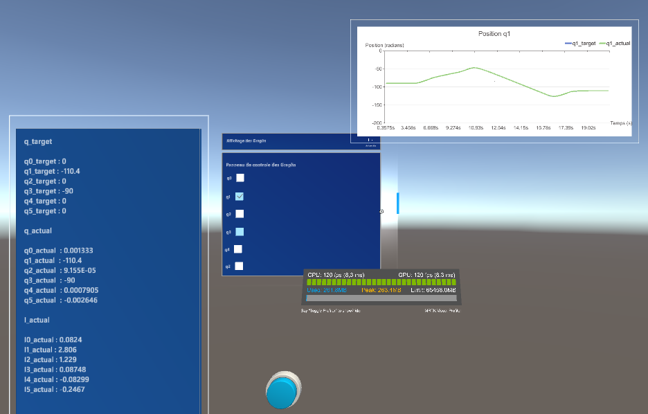

Elle comporte :

- Un Panneau affichant les positions et le courant
- Un Panneau permettant de choisir le graphique à afficher
- Un bouton pour remettre le bras à la vertical
  

### Problèmes rencontrés et limitations

#### Premier code pour la réception

Dans le premier scrip, je lançais une connection dans le start(), puis lisais les messages dans update().
L'application se bloquait (crah) au bout d'un certain temps sur unity et très rapidement sur les lunettes (moins d'une minute). Cela venait du fait que je n'instanciais qu'une seule connection client dans le start(), même si je ne lisais pas les messages ils etaient enregistrés en mémoire. Ainsi à chaque lecture du message je lisais le dernier message non lu tandis qu'en parallèle les messages continuaient à s'accumuler. On observait alors un retard entre la position affichée et la position réel du robot. Lorque le retard devient trop important l'application crash.

Pour résoudre ce problème, au lieu de n'avoir qu'une seule connection, j'intancie une nouvelle connection dans le update() à chaque fois que je veux lire les données puis la ferme. Ceci empêche l'accumulation d'un retard. Cependant, l'action de connection, déconnection prend du temps et je n'arrive pas à récupérer plus de 5 messages par secondes. 

Avec l'affichage des graphiques, on perd encore un peu plus en données réceptionnées. En effet, le framerate à diminuer et pour tracer 50 points sur mon graphique, il faut environs 20 secondes sur unity (soit 2.5 points/secondes) et 50 secondes sur les hololens (soit 1 point/seconde...).

### Pistes exploitées non concluantes

L'ojectif est donc de pouvoir lire les messages envoyés par l'UR10 de manière ponctuelle et non régulière (à cause du framerate non constant). Je me suis donc penchée vers les méthodes de socket asynchrone. Cependant après documentation, ces méthodes permettent de ne plus rendre bloquante les fonctions socket.connect() et socket.receive(), mais cela ne permettrait pas de résoudre le problème ici d'une trop grande récéption de message par rapport à la vitesse possible de lecture.

### Amélioration avec surcharges de la méthode socket.receive()

J'ai donc cherché une manière de "resynchroniser" la réception des messages au lieu de réouvri une communication à chaque lecture. Pour cela, j'ai utilisée les surcharges de la méthode socket.receive(Byte[],int32, int32, SocketFlags).

- Paramètre 1 : Bytes[] => Buffer de réception où l'on stocke les messages lus (seul paramètre utilisé jusqu'alors)
- Paramètre 2 : int32 => Position dans le buffer où l'on commence à stocker les données (offset)
- Paramètre 3 : int32 => taille (en octets) des données lues
- Paramètre 4 : SocketFlags => Spécifie le comportement d'envoi et de réception du socket, j'ai mis ce paramètre à SocketFlags.None (aucun indicateur utilisé)

Plutôt que de lire les trames une par une (buffer de 812 octets), je vais lire plusieurs trames d'un coup grâce au paramètre 3 et dans un premier temps, ne traiter que la première. 

Exemple : 
Imaginons que je ne souhiate traiter qu'une trame toutes les secondes. 

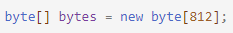

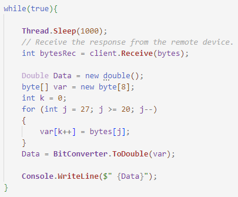

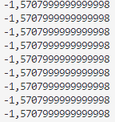

En bougeant le robot, la valeur ne s'actualise pas puisque je suis encore en train de lire les premières trames envoyées par l'UR10.

Pour rester synchroniser il faut donc que je lise d'un seul coup 125 trames, soit 125*812 = 101 500 octets.

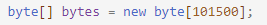

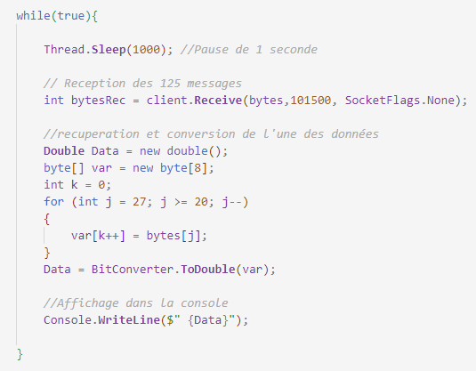

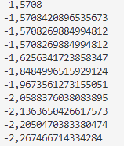

On voit bien ici dans la console qu'on actualise alors bien les messages (lorsque l'on déplace le robot, la valeur est bien actualisée toutes les secondes). La taille du buffer bytes doit aussi être actualisée car elle ne peut pas être plus petite que le paramètre 3.

J'ai implémenter cette solution dans unity en faisant varier le paramètre 3 en fonction du framerate actuel (grâce à Time.deltatime qui renvoie le temps écoulé depuis la dernière frame).

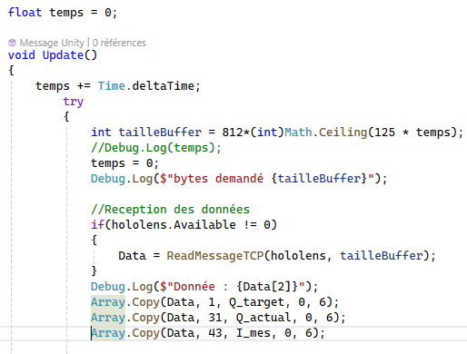

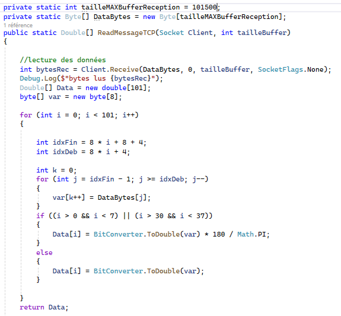

Je peux ainsi (sur unity) récupérer 153 données par seconde (au lieu de 5).

Cependant, sur les graphiques on apperçoie parfois des valeurs à 0 (environ 3 sur les 500).
Dans la console cela se traduit par :

On s'appercoie que parfois, on se desynchronise et on ne recoie pas le bon nombre d'octets.

Pour remedier à cela et comme c'est un evenemment qui reste rare, je n'actualise mes données que si le nombre d'octets reçus est égal au nombre d'octet demandé. 

# Sources/liens utiles

Manuel unity :
https://docs.unity3d.com/Manual/CreatingAndUsingScripts.html

https://creativetech-fr.devoteam.com/2020/02/07/comprendre-la-pile-dexecution-dun-moteur-3d-unity/

